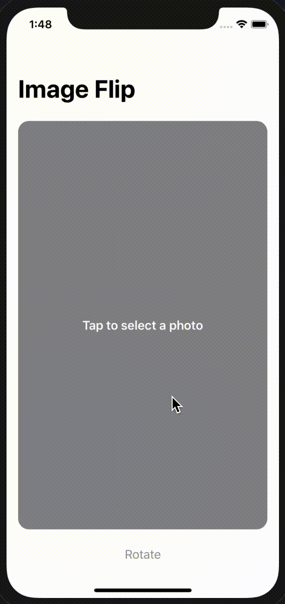

# 100Apps-10FlipImage

App 10 of my 100 App Challenge - https://github.com/Whoopinstick/100AppsChallenge

10 - Flip Image

Written with SwiftUI and UIKit

This app loads a photo from the user's photo library.  Then, they can rotate the image.

